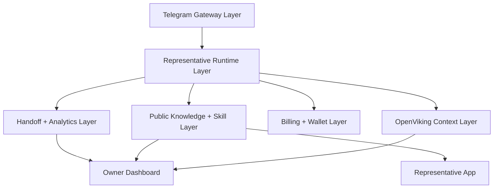

# Delegate Architecture

## Product thesis

Delegate is not a private assistant exposed to the public. It is a separate public runtime that represents a founder or business on Telegram using only public knowledge and explicitly allowed actions.

That single decision drives the whole system:

- public knowledge in
- bounded actions only
- no private workspace access
- paid continuation instead of unlimited free chat
- structured human handoff instead of vague escalation

## Scope locked for v1

### In

- Telegram private chat as the primary entry
- public representative page
- FAQ answering from structured knowledge
- lead qualification and intake
- materials delivery
- paid continuation with `Free`, `Pass`, `Deep Help`, `Sponsor`
- owner inbox for human handoff
- action gate and event audit trail

### Out

- WhatsApp
- WeChat
- private knowledge access
- arbitrary tool calling
- direct calendar mutation
- silent outbound sales or marketing automation
- team-level permission complexity

## System layers

Delegate also ships a separate marketing `Site` service, but it sits outside the runtime loop and acts as the top-of-funnel surface that links into the dashboard and representative app.

For the next-phase target architecture, including the planned isolated compute plane and Claude-inspired capability decisions, see [docs/delegate-architecture-decisions.md](./delegate-architecture-decisions.md).

## Core runtime loop

1. Telegram message enters through private chat or a clearly addressed group mention.
2. Runtime resolves the representative, channel, and conversation state.
3. Inquiry is classified into a narrow intent such as FAQ, pricing, materials, scheduling, or handoff.
4. `Action Gate` checks whether the next action is allowed, ask-first, or denied.
5. Conversation contract decides whether the message stays in free mode, should collect structured intake, or should trigger a paid unlock.
6. Runtime returns one of four next steps:
   - answer directly
   - collect intake
   - offer paid continuation
   - create human handoff
7. Runtime can recall representative-scoped resources, contact-scoped public-safe memories, and representative agent patterns from OpenViking before composing the next answer.
8. Runtime can commit safe session context after useful turns, collector completions, paid unlocks, and handoff outcomes.
9. Every step emits an audit event for analytics and future owner review.

## Data model summary

### Representative

Owns identity, tone, public boundaries, pricing, public knowledge, allowed skills, and handoff policy.

### Public Knowledge Pack

Structured public content split into:

- identity and positioning
- policies and boundaries
- FAQ
- materials and links

### OpenViking context layer

OpenViking augments, but does not replace, Postgres.

- Postgres remains the source of truth for contacts, conversations, invoices, handoffs, and dashboard analytics.
- OpenViking stores representative-scoped public resources plus public-safe long-term context.
- Resource URIs live under `viking://resources/delegate/reps/{slug}/...`.
- Contact memories live under representative-scoped `viking://user/memories/.../{slug}/{contactId}/...`.
- Agent patterns live under representative-scoped `viking://agent/memories/.../{slug}/...`.
- Delegate stores recall provenance and commit traces in Postgres for debugging and auditability.

### Conversation Contract

Defines:

- free reply limit
- what is allowed in free mode
- when to collect intake
- when to move to paid continuation
- when human handoff is allowed

### Wallet and billing

Tracks:

- owner credits
- sponsor pool credits
- Stars plan purchases
- paywall decisions and invoice lifecycle

### Handoff and analytics

Tracks:

- structured intake submissions
- why handoff was requested
- whether the requester paid
- whether the owner should personally step in

## Security boundary

The boundary is a first-class product feature, not a prompt convention.

### Can see

- public bio
- public FAQ
- public pricing and materials
- public availability rules

### Can do

- answer FAQ
- collect lead and quote intake
- deliver documents and links
- offer paid continuation
- request human handoff

### Cannot do

- access private memory
- read local files
- execute commands
- log into owner accounts
- change the owner's real calendar
- make irreversible commercial commitments

### Ask first

- discounts
- refunds
- sending sensitive materials
- priority human escalation

## OpenViking operating rules

- OpenViking runs as a standalone HTTP service in Docker for local and production-style development.
- Delegate uses OpenViking's `Create -> Interact -> Commit` session lifecycle.
- Default recall behavior is `L1` first, then `L2` only when the runtime needs more detail.
- If OpenViking is unavailable, or model credentials are missing, Delegate falls back to deterministic policy behavior instead of failing open.
- OpenViking never receives owner-private notes, secrets, wallet internals, or hidden admin context.

## Recommended stack

- `Next.js` for three separate web services: marketing site, representative app, and owner dashboard
- `grammY` for the Telegram runtime
- `Prisma + Postgres` for persisted conversations, leads, handoffs, and billing state
- shared `zod` schemas for the boundary between runtime, UI, and future APIs
- `ClawHub` as a discovery source for non-privileged representative skill packs

## Telegram-specific product choices

- Start with private chat only, but keep group mention mode in the runtime contract.
- Treat group activation as a first-class policy: default to `reply_or_mention`, not ambient listening.
- Use deep links as the main acquisition primitive.
- Treat Stars as the default payment surface for user-facing continuation plans.
- Default to conservative group behavior: only answer in groups when explicitly addressed.

## External skill registry policy

OpenClaw's ClawHub pattern is worth adopting, but with a narrower trust boundary than OpenClaw itself.

- Delegate may discover and version representative skill packs from ClawHub.
- Delegate should store source, version, install time, and verification metadata for each installed pack.
- Delegate should not treat ClawHub code plugins as executable authority inside the public representative runtime.
- Only declarative or explicitly reviewed representative workflows should be allowed into production reps.

## Official Telegram references

- Deep links: <https://core.telegram.org/api/links>
- Bot payments: <https://core.telegram.org/bots/payments>
- Bot API: <https://core.telegram.org/bots/api>
