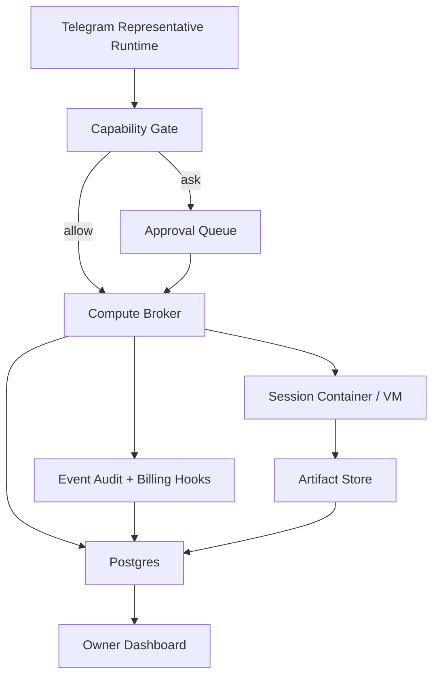
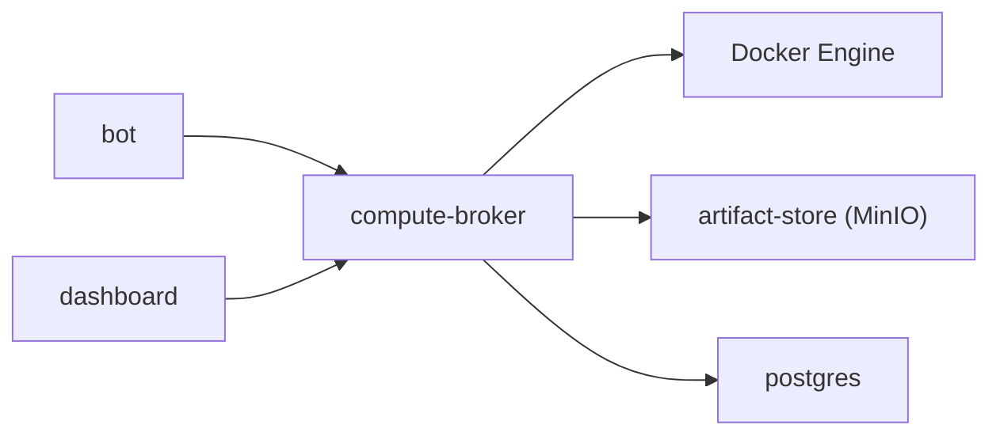

# V2 Isolated Compute Plane Plan

## Purpose

This document turns the `V2: Isolated Compute Plane` roadmap item into an engineering task list that can be executed inside the current Delegate monorepo.

It is intentionally narrower than the broader architecture decisions:

- V2 covers isolated general compute for `exec`, `read`, `write`, and `process`
- browser-heavy execution remains primarily a `V2.5` concern
- the public representative product boundary still applies

## Product goal

Let a Telegram public representative use general compute safely without:

- touching the owner's host machine
- silently running privileged actions
- bypassing billing
- mixing raw compute artifacts into public memory

The public-facing contract should remain understandable:

- this representative may run approved tasks in isolated environments
- some actions are automatic
- some actions require owner approval
- every action is auditable

## Non-goals for V2

- no full browser-first automation as a core dependency
- no direct host execution
- no arbitrary third-party plugin execution in the representative runtime
- no long-running workflow engine migration yet
- no multi-tenant remote compute marketplace yet

## Current repo anchors

This plan assumes the current repo structure:

- `apps/bot`: Telegram runtime
- `apps/web`: owner dashboard
- `packages/domain`: shared schema surface
- `packages/runtime`: action-gate and collector logic
- `packages/openviking`: memory and context client
- `prisma/schema.prisma`: transactional schema
- `compose.yml`: local stack definition

## Target system shape



## Proposed repo additions

### New app/service

- `apps/compute-broker`
  - receives compute execution requests
  - evaluates final runtime safety checks before lease issuance
  - creates and tears down containers
  - records tool executions and session state
  - emits billing and audit events

### New shared packages

- `packages/compute-protocol`
  - typed request/response schema for compute actions
  - lease lifecycle types
  - artifact metadata types

- `packages/capability-policy`
  - `allow / ask / deny` evaluator
  - path, command, network, and budget rules
  - reusable across bot, dashboard, and broker

- `packages/artifacts`
  - artifact naming rules
  - retention helpers
  - object-store client wrapper

## Prisma workstream

### New enums

Add:

- `CapabilityKind`
  - `EXEC`
  - `READ`
  - `WRITE`
  - `PROCESS`
  - `BROWSER` for future compatibility

- `PolicyDecision`
  - `ALLOW`
  - `ASK`
  - `DENY`

- `ComputeSessionStatus`
  - `REQUESTED`
  - `STARTING`
  - `RUNNING`
  - `IDLE`
  - `STOPPING`
  - `COMPLETED`
  - `FAILED`
  - `EXPIRED`

- `ToolExecutionStatus`
  - `QUEUED`
  - `RUNNING`
  - `SUCCEEDED`
  - `FAILED`
  - `BLOCKED`
  - `CANCELED`

- `ApprovalStatus`
  - `PENDING`
  - `APPROVED`
  - `REJECTED`
  - `EXPIRED`

- `ArtifactKind`
  - `STDOUT`
  - `STDERR`
  - `FILE`
  - `ARCHIVE`
  - `SCREENSHOT`
  - `JSON`
  - `TRACE`

- `LedgerEntryKind`
  - `MODEL_USAGE`
  - `COMPUTE_MINUTES`
  - `STORAGE_BYTES`
  - `ARTIFACT_EGRESS`
  - `BROWSER_MINUTES`
  - `PLAN_DEBIT`
  - `SPONSOR_CREDIT`

### Representative-level fields

Either inline on `Representative` or via a dedicated profile model:

- `computeEnabled`
- `computeDefaultPolicyMode`
- `computeBaseImage`
- `computeMaxSessionMinutes`
- `computeAutoApproveBudgetCents`
- `computeArtifactRetentionDays`
- `computeNetworkMode`
- `computeFilesystemMode`

Recommendation:

- keep high-level representative defaults inline
- keep detailed rules in dedicated tables

### New tables

#### `CapabilityPolicyProfile`

Represents the policy bundle attached to a representative.

Fields:

- `id`
- `representativeId`
- `name`
- `defaultDecision`
- `maxSessionMinutes`
- `maxParallelSessions`
- `maxCommandSeconds`
- `artifactRetentionDays`
- `networkMode`
- `filesystemMode`
- `createdAt`
- `updatedAt`

#### `CapabilityPolicyRule`

Per-capability matching rules.

Fields:

- `id`
- `profileId`
- `capability`
- `decision`
- `commandPattern`
- `pathPattern`
- `domainPattern`
- `maxCostCents`
- `requiresPaidPlan`
- `requiresHumanApproval`
- `priority`
- `createdAt`
- `updatedAt`

#### `ComputeSession`

One isolated sandbox lifecycle.

Fields:

- `id`
- `representativeId`
- `contactId`
- `conversationId`
- `requestedBy`
  - `SYSTEM`
  - `OWNER`
  - `AUDIENCE`
- `status`
- `containerId`
- `runnerType`
  - `DOCKER`
  - `VM`
- `baseImage`
- `leaseTokenHash`
- `startedAt`
- `lastHeartbeatAt`
- `expiresAt`
- `endedAt`
- `failureReason`
- `createdAt`
- `updatedAt`

#### `ToolExecution`

One concrete compute action.

Fields:

- `id`
- `sessionId`
- `capability`
- `status`
- `requestedCommand`
- `requestedPath`
- `workingDirectory`
- `policyDecision`
- `approvalRequestId`
- `startedAt`
- `finishedAt`
- `exitCode`
- `cpuMs`
- `wallMs`
- `bytesRead`
- `bytesWritten`
- `createdAt`

#### `ApprovalRequest`

Approval object for `ask` decisions.

Fields:

- `id`
- `representativeId`
- `contactId`
- `conversationId`
- `sessionId`
- `toolExecutionId`
- `status`
- `reason`
- `requestedActionSummary`
- `riskSummary`
- `requestedAt`
- `resolvedAt`
- `resolvedBy`

#### `Artifact`

Metadata for persisted outputs.

Fields:

- `id`
- `representativeId`
- `contactId`
- `conversationId`
- `sessionId`
- `toolExecutionId`
- `kind`
- `bucket`
- `objectKey`
- `mimeType`
- `sizeBytes`
- `sha256`
- `retentionUntil`
- `summary`
- `createdAt`

#### `LedgerEntry`

Internal cost and external billing event.

Fields:

- `id`
- `representativeId`
- `contactId`
- `conversationId`
- `invoiceId`
- `sessionId`
- `toolExecutionId`
- `kind`
- `quantity`
- `unit`
- `costCents`
- `creditDelta`
- `currency`
- `notes`
- `createdAt`

### Existing table changes

#### `EventAudit`

Add event types:

- `COMPUTE_SESSION_REQUESTED`
- `COMPUTE_SESSION_STARTED`
- `COMPUTE_SESSION_TERMINATED`
- `TOOL_EXECUTION_REQUESTED`
- `TOOL_EXECUTION_BLOCKED`
- `TOOL_EXECUTION_COMPLETED`
- `APPROVAL_REQUESTED`
- `APPROVAL_RESOLVED`
- `ARTIFACT_STORED`
- `BILLING_LEDGER_RECORDED`

#### `Conversation`

Add:

- `activeComputeSessionId`
- `computeBudgetRemainingCredits`
- `lastComputeAt`

#### `Contact`

Add:

- `computeTrustTier`
- `lastApprovalGrantedAt`

## Service workstream

## 1. Compute broker service

### Responsibility

The broker is the only service allowed to touch the container runtime in local V2.

It should:

- accept signed internal execution requests
- resolve representative policy profile
- evaluate final capability rules
- create a compute lease
- launch the sandbox
- stream or poll execution result
- persist artifacts
- emit billing and audit records

### Internal API surface

Recommended endpoints:

- `POST /internal/compute/sessions`
- `POST /internal/compute/sessions/:id/executions`
- `POST /internal/compute/sessions/:id/heartbeat`
- `POST /internal/compute/sessions/:id/terminate`
- `GET /internal/compute/sessions/:id`
- `GET /internal/compute/sessions/:id/artifacts`

### Runtime model

In V2 local/dev:

- broker launches Docker containers directly
- only broker gets access to Docker socket
- public services do not get Docker access

In later prod:

- replace local Docker launch with a remote runner pool or Kubernetes job/controller

## 2. Sandbox runner image

Create a dedicated base image for compute sessions.

Contents:

- Node runtime
- minimal shell utilities
- locked-down filesystem layout
- writable workdir only under `/workspace`
- no owner secrets baked into image
- artifact uploader sidecar binary or lightweight client

V2 rule:

- no browser binaries required in the base image yet
- browser lane can come in V2.5

## 3. Session lease model

Every compute session should use:

- one lease token
- one sandbox
- one representative
- one contact
- one conversation

The lease should carry:

- allowed capabilities
- expiry
- max runtime
- artifact retention policy
- max cost ceiling

## Docker topology workstream

## Local compose changes

Add services:

- `compute-broker`
- `artifact-store`
- `artifact-store-init`

Recommended local topology:



### `compute-broker`

Requirements:

- internal-only port in compose network
- Docker socket mounted only here in local dev
- environment for object store credentials
- environment for default runner image

### `artifact-store`

Use MinIO in local dev.

Requirements:

- separate bucket for compute artifacts
- retention policy configuration
- no public anonymous reads

### `artifact-store-init`

Creates:

- bucket
- lifecycle policy
- least-privilege access key for broker

## Policy engine workstream

## Decision model

All compute actions go through:

1. representative default policy
2. capability-specific rules
3. path/command/domain matching
4. plan-tier and budget checks
5. contact trust tier
6. final result: `allow`, `ask`, or `deny`

## First V2 rule families

### Command rules

- block package managers by default
- block `sudo`, `docker`, `ssh`, `curl | sh`, and similar escalations
- allow a narrow starter set:
  - `ls`
  - `cat`
  - `rg`
  - `node`
  - `python`
  - project-local scripts under `/workspace`

### Path rules

- deny paths outside mounted workspace
- deny dotfiles containing secrets
- deny shell history
- deny mounted credentials

### Cost and duration rules

- auto-stop on runtime limit
- route to `ask` when predicted cost exceeds threshold
- route to `ask` when artifact egress exceeds threshold

### Trust rules

- public user cannot silently trigger high-cost compute
- owner-triggered actions may still hit `ask` for dangerous capability classes

## Approval UX

Dashboard requirements:

- pending approvals queue
- action summary
- command/path preview
- reason for policy escalation
- approve/reject with expiry

Bot requirements:

- representative can tell user when a task requires owner approval
- owner can receive approval request in inbox or dashboard

## Artifact storage workstream

## Storage design

Persist raw outputs outside Postgres.

Store:

- stdout/stderr text blobs
- generated files
- zip bundles
- structured JSON outputs
- traces

Do not store raw artifacts in OpenViking.

## Object key strategy

Recommended key layout:

```text
delegate/
  reps/{repSlug}/
    contacts/{contactId}/
      conversations/{conversationId}/
        sessions/{sessionId}/
          executions/{executionId}/
            {artifactKind}-{artifactId}
```

## Retention policy

V2 default:

- logs: 14 days
- generated files: 30 days
- owner-pinned artifacts: no auto-delete until unpinned

## Summarization path

After execution completes:

- raw artifact stays in object store
- broker creates short summary for dashboard
- only safe summary may be eligible for memory promotion later

## Billing hooks workstream

## Dual-ledger principle

Keep user-facing credits separate from internal cost accounting.

### User-facing debits

- `Compute Pass` consumption
- `Deep Help` compute allotment usage
- sponsor-pool consumption when configured

### Internal cost entries

- model usage during planning or summarization
- compute wall time
- CPU or memory overage if later needed
- artifact storage bytes
- artifact egress

## Hook points

Add billing hooks at:

- compute session created
- execution started
- execution completed
- artifact persisted
- session expired or terminated early

## V2 commercial rule

Before running non-trivial compute:

- verify plan entitlement or available credits
- if not enough credits:
  - offer `Compute Pass`
  - do not launch sandbox

## Dashboard workstream

Add a new dashboard lane after V2:

- `Compute`

The lane should show:

- active sessions
- recent executions
- pending approvals
- artifact list
- compute credit burn
- blocked actions and policy reasons

Representative setup should also gain:

- compute enabled toggle
- default base image selector
- max session minutes
- auto-approve budget
- artifact retention days
- path/domain policy editor

## Bot/runtime integration workstream

## New execution flow

1. user asks for a task that needs general compute
2. runtime classifies it as compute-capable
3. runtime creates a draft execution request
4. policy engine returns `allow`, `ask`, or `deny`
5. if `allow`, broker starts session and runs task
6. if `ask`, create approval request and notify owner
7. when done, runtime returns summary and optional artifact links
8. billing hooks and audit events are recorded

## Memory guardrails

V2 should not auto-promote raw compute output into OpenViking.

Only allow promotion of:

- short summaries
- durable user preferences learned from task completion
- representative-safe reusable patterns

Never promote:

- raw file contents
- secrets
- credential material
- owner-private business data from compute output

## Acceptance criteria

V2 is done when:

- a representative can run approved `exec/read/write/process` tasks in an isolated container
- no representative-triggered compute touches the host directly
- every execution has a policy decision, audit event, and billing record
- artifacts are stored outside Postgres and visible in dashboard
- approval-required tasks are blocked until owner action
- failed sessions clean up after themselves

## Task breakdown

## A. Schema and shared types

- add new enums and Prisma models
- add shared Zod schemas in `packages/domain` or `packages/compute-protocol`
- extend `EventAudit` event types
- add seeds for one representative with compute disabled by default

## B. Broker foundation

- scaffold `apps/compute-broker`
- implement lease creation
- implement Docker runner adapter
- implement heartbeat and termination
- add internal auth between bot/dashboard and broker

## C. Policy engine

- create `packages/capability-policy`
- implement rule matching
- add default policy packs
- add approval-request creation path

## D. Artifact layer

- add MinIO to compose
- add artifact bucket bootstrap
- implement artifact metadata persistence
- add retention metadata and cleanup job placeholder

## E. Billing hooks

- add ledger model and debit rules
- enforce entitlement checks before session start
- record internal usage on execution completion

## F. Dashboard

- add compute lane
- add approval queue
- add session/execution tables
- add artifact viewer/download links
- add compute policy editor in representative setup

## G. Bot integration

- add compute-intent path in runtime
- add execution summary responses
- add owner approval messaging
- add failure and timeout UX

## H. Verification

- unit tests for policy decisions
- integration test for broker session lifecycle
- integration test for artifact persistence
- integration test for approval gating
- regression test ensuring compute output does not auto-enter public memory

## Open questions

- do we want one reusable long-lived session per conversation, or strict one-task sessions in V2?
- do owner-triggered tasks share the same compute plane as public representative tasks, or need a separate owner-operator trust tier?
- should V2 support outbound network by default, or start with local-workspace-only mode?
- when a task creates multiple files, what is the default user-facing artifact packaging strategy?

## Suggested implementation phases

These phases are meant to be small enough for incremental delivery while still landing useful vertical slices.

### Phase A: Safe foundation

Goal:

- land the minimum data model and service skeleton needed to create isolated compute sessions without exposing them to end users yet

Includes:

- Prisma schema additions
- `packages/compute-protocol`
- `packages/capability-policy`
- `apps/compute-broker` skeleton
- Docker topology updates for `compute-broker` and `artifact-store`
- internal auth between bot/dashboard and broker
- broker health endpoints
- one default representative policy profile with compute disabled

Deliverable:

- a local stack where broker and artifact store boot successfully
- a broker integration test can create and terminate an empty compute session

Recommended ticket split:

1. schema migration
2. compute protocol package
3. capability policy package
4. compute broker app skeleton
5. compose updates

### Phase B: One vertical slice

Goal:

- ship one end-to-end compute capability with strong policy control

Recommended first slice:

- `exec` with a very narrow command allowlist

Includes:

- `allow / ask / deny` evaluation
- `ToolExecution` persistence
- one Docker runner adapter
- stdout/stderr artifact persistence
- billing ledger writes
- dashboard read-only compute lane
- bot/runtime path for one compute-capable intent

Deliverable:

- a representative can run one approved command in an isolated container
- blocked commands produce policy-driven responses
- approval-required commands create approval objects instead of executing

Recommended ticket split:

1. policy evaluation engine
2. Docker exec runner
3. artifact upload + metadata write
4. billing ledger hooks
5. dashboard session list
6. bot/runtime integration

### Phase C: Approval and operator control

Goal:

- turn compute from an internal feature into a governable owner feature

Includes:

- approval queue UI
- approval resolution API
- cost ceiling enforcement
- artifact viewer/download links
- representative-level compute settings
- policy rule editor
- audit event detail views

Deliverable:

- owner can approve or reject risky compute actions from dashboard
- representative clearly explains blocked vs pending vs completed compute tasks
- compute costs and outputs are visible to the owner

Recommended ticket split:

1. approval queue and status APIs
2. dashboard approvals panel
3. representative setup compute policy editor
4. cost ceiling and retention settings
5. audit and artifact detail views

### Phase D: Hardening

Goal:

- make the V2 compute plane reliable enough for real usage, not just demo flows

Includes:

- heartbeat expiry cleanup
- orphaned container cleanup
- artifact retention worker
- concurrency limits
- timeout enforcement
- regression suite for memory leakage and host isolation

Deliverable:

- failed or abandoned sessions clean themselves up
- broker survives retries and partial failures cleanly

## Suggested directory structure

Recommended additions relative to the current repo:

```text
apps/
  bot/
  compute-broker/
    src/
      index.ts
      config.ts
      auth.ts
      sessions.ts
      executions.ts
      docker-runner.ts
      artifacts.ts
      billing.ts
      approvals.ts
      routes/
        health.ts
        sessions.ts
        executions.ts
        approvals.ts
packages/
  artifacts/
    src/
      index.ts
      keys.ts
      client.ts
      retention.ts
      summary.ts
  capability-policy/
    src/
      index.ts
      types.ts
      evaluator.ts
      matchers.ts
      defaults.ts
      risk.ts
  compute-protocol/
    src/
      index.ts
      requests.ts
      responses.ts
      events.ts
      artifacts.ts
      leases.ts
```

Recommended dashboard additions:

```text
apps/web/app/dashboard/
  dashboard-compute.tsx
  dashboard-compute-approvals.tsx
  dashboard-compute-artifacts.tsx
apps/web/app/api/dashboard/representatives/[slug]/compute/
  route.ts
  sessions/route.ts
  approvals/route.ts
  artifacts/route.ts
```

Recommended bot/runtime additions:

```text
apps/bot/src/
  compute-intents.ts
  compute-runtime.ts
  compute-approval.ts
packages/runtime/src/
  compute-routing.ts
  capability-intents.ts
```

Recommended infrastructure additions:

```text
deploy/
  compute-runner/
    Dockerfile
    entrypoint.sh
  minio/
    bootstrap.sh
```

## Recommended first milestone branch plan

If the team wants a practical branch-by-branch sequence, use:

1. `codex/v2-compute-schema-foundation`
2. `codex/v2-compute-broker-skeleton`
3. `codex/v2-compute-policy-engine`
4. `codex/v2-compute-artifacts-and-ledger`
5. `codex/v2-compute-dashboard-lane`
6. `codex/v2-compute-bot-integration`

That ordering keeps infra risk, product risk, and UI risk separated enough to review cleanly.
